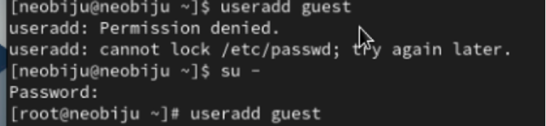
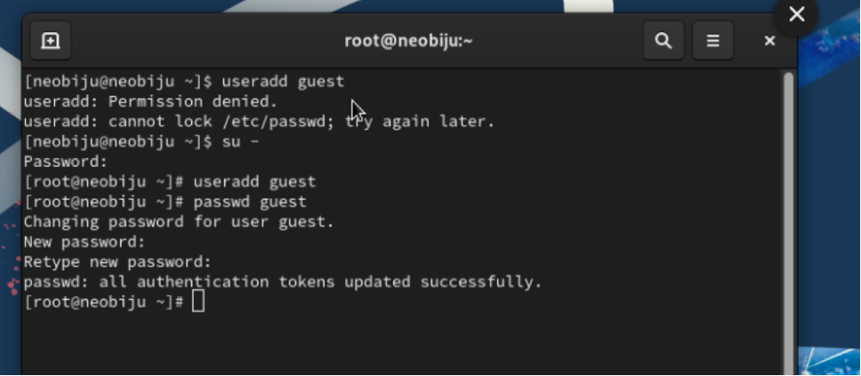
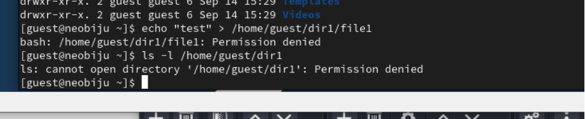

---
## Front matter
title: "Отчет по лабораторной работе №4"
subtitle: "Дискреционное разграничение прав в Linux. Расширенные атрибуты"
author: "Петрова Мария Евгеньевна"

## Generic otions
lang: ru-RU
toc-title: "Содержание"
## Pdf output format
toc: true # Table of contents
toc-depth: 2
lof: true # List of figures
lot: true # List of tables
fontsize: 12pt
linestretch: 1.5
papersize: a4
documentclass: scrreprt
## I18n polyglossia
polyglossia-lang:
  name: russian
  options:
  - spelling=modern
  - babelshorthands=true
polyglossia-otherlangs:
  name: english
## I18n babel
babel-lang: russian
babel-otherlangs: english
## Fonts
mainfont: PT Serif
romanfont: PT Serif
sansfont: PT Sans
monofont: PT Mono
mainfontoptions: Ligatures=TeX
romanfontoptions: Ligatures=TeX
sansfontoptions: Ligatures=TeX,Scale=MatchLowercase
monofontoptions: Scale=MatchLowercase,Scale=0.9
## Biblatex
biblatex: true
biblio-style: "gost-numeric"
biblatexoptions:
  - parentracker=true
  - backend=biber
  - hyperref=auto
  - language=auto
  - autolang=other*
  - citestyle=gost-numeric
## Pandoc-crossref LaTeX customization
figureTitle: "Рис."
tableTitle: "Таблица"
listingTitle: "Листинг"
lofTitle: "Список иллюстраций"
lotTitle: "Список таблиц"
lolTitle: "Листинги"
## Misc options
indent: true
header-includes:
  - \usepackage{indentfirst}
  - \usepackage{float} # keep figures where there are in the text
  - \floatplacement{figure}{H} # keep figures where there are in the text
---

# Цель работы

Получение практических навыков работы в консоли с расширенными атрибутами файлов.

# Выполнение лабораторной работы

1. От имени пользователя guest определила расширенные атрибуты файла.

2. Установила командой на файл file1 права, разрешающие чтение и запись для владельца файла. 

3. Попробовала установить на файл /home/guest/dir1/file1 расширенный атрибут a от имени пользователя guest. В ответ получила отказ от выполнения операции.

4. Повысила свои права с помощью команды su. Попробовала установить расширенный атрибут a на файл /home/guest/dir1/file1 от имени суперпользователя.

5. От пользователя guest проверила правильность установления атрибута. Все установилось. 

{ #fig:002 width=70% }

6. Выполнила дозапись в файл file1 слова «test» командой. После этого выполнила чтение файла file1. 
{ #fig:003 width=70% }

7. Попробовала стереть имеющуюся в нём информацию. Попробовала переименовать файл. Попробуйте установить на файл file1 права, например, запрещающие чтение и запись для владельца файла. На все выдает ошибку. 

9. Сняла расширенный атрибут a с файла /home/guest/dirl/file1 от имени суперпользователя. 

10. Повторила операции, которые ранее не удавалось выполнить.

# Вывод

Получила практические навыки работы в консоли с расширенными атрибутами файлов.
