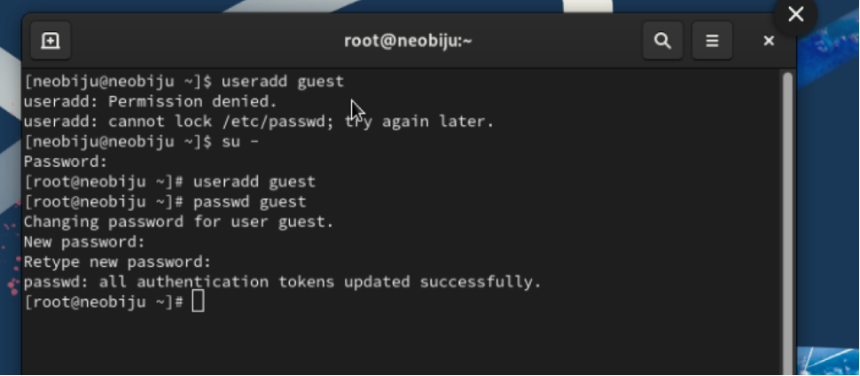
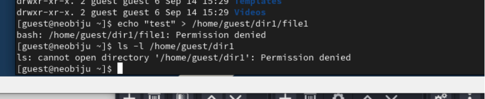

---
## Front matter
lang: ru-RU
title: Лабораторная работа №4
subtitle: Дискреционное разграничение прав в Linux. Расширенные атрибуты.
author:
  - Петрова М.Е.
institute:
  - Российский университет дружбы народов

## i18n babel
babel-lang: russian
babel-otherlangs: english

## Formatting pdf
toc: false
toc-title: Содержание
slide_level: 2
aspectratio: 169
section-titles: true
theme: metropolis
header-includes:
 - \metroset{progressbar=frametitle,sectionpage=progressbar,numbering=fraction}
 - '\makeatletter'
 - '\makeatother'
---

# Информация

## Докладчик

  * Петрова Мария Евгеньевна
  * НФИбд-02-21
  * Российский университет дружбы народов

# Выполнение

## Цель работы

Получение практических навыков работы в консоли с расширенными атрибутами файлов.

# Выполнение лабораторной работы

1. От имени пользователя guest определила расширенные атрибуты файла.

2. Установила командой на файл file1 права, разрешающие чтение и запись для владельца файла.

##

3. Попробовала установить на файл расширенный атрибут a от имени пользователя guest. В ответ получила отказ от выполнения операции.

##

4. Повысила свои права с помощью команды su. Попробовала установить расширенный атрибут a на файл от имени суперпользователя.

5. От пользователя guest проверила правильность установления атрибута. Все установилось. 

##

6. Выполнила дозапись в файл file1 слова «test» командой. После этого выполнила чтение файла file1. 

##

7. Попробовала стереть имеющуюся в нём информацию. Попробовала переименовать файл. Попробуйте установить на файл file1 права, например, запрещающие чтение и запись для владельца файла. На все выдает ошибку. 

9. Сняла расширенный атрибут a с файла /home/guest/dirl/file1 от имени суперпользователя. 

##

10. Повторила операции, которые ранее не удавалось выполнить. 

# Вывод

Получила практические навыки работы в консоли с расширенными атрибутами файлов.
